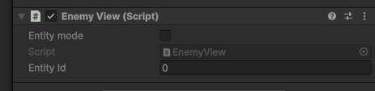
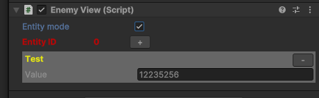
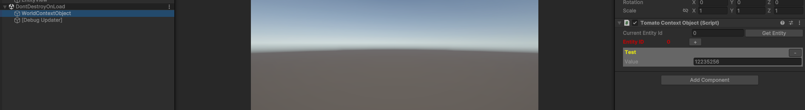

# Tomato Entity Drawer

Visual debug for Tomato ECS. Allows you to see and modify components and values in runtime

## How to Install

First u need to install tomato ECS from
`https://github.com/natpuncher/tomato-ecs.git`

Then install drawer using package manager install from Git URL

`https://github.com/heavyfront/Tomato-Entity-Drawer.git`

## How to use

You can inherit your context from BaseContext and your views from EntityView

```csharp
    public class EnemyView : EntityView
    {

    }
    
    
    public abstract class EntityView : MonoBehaviour
    {
        [SerializeField, ReadOnly] protected uint _entityId;

        public uint EntityId => _entityId;

        public void SetupData(uint id)
        {
            _entityId = id;
        }
    }
```

Then you need to initialize context game object in any place you want. I prefer do it in ESC initialization

```csharp

 public void Initialize()
        {
            _context = new WorldContext();  // you need to get instance of context from anywhere u want
           
            // create context game object and initialize it
            var cgo = new GameObject("WorldContextObject");
            DontDestroyOnLoad(cgo);
            _tomatoContextObject = cgo.AddComponent<TomatoContextObject>();
            _tomatoContextObject.Initialize(_context);
            
            // Now you can use ECS as usual with one condition. You need to use SetupData every time you create any view.
            var entity = _context.CreateEntity();
            var go = new GameObject("EntityView");
            
            
            var view = go.AddComponent<EnemyView>();
            
            
            view.SetupData(entity.Id); // it needed for  visual debugging using view object
            
            
            entity.AddComponent<TestComponent>().Value = 12235256;

        }

```
Now you can see checkbox Entity mode on any EntityView object. It allows you to switch between standard and debug modes.



In debug mode you can add, remove, and edit components



You can also use debugging on entities without display using the TomatoContextObject object.
Just enter entity ID and press get entity button.


